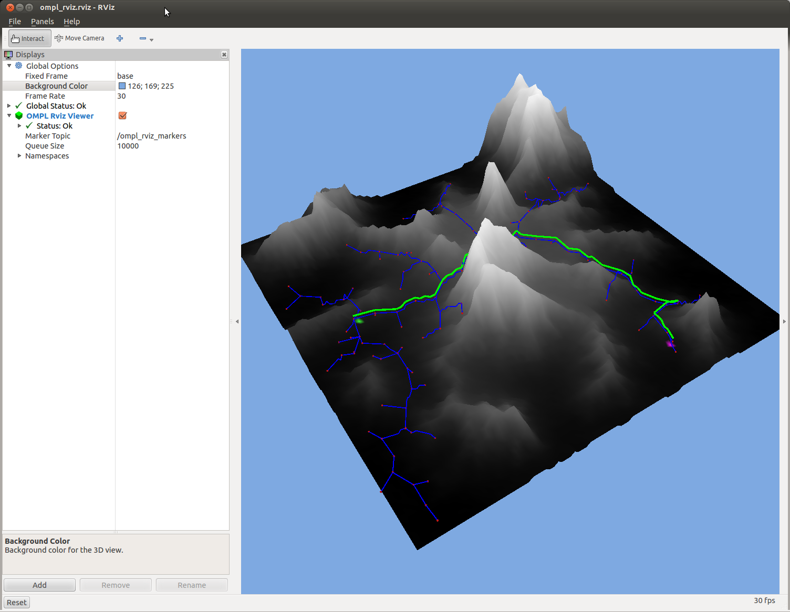

# OMPL Visual Tools

The OMPL Visual Tools is a library for visualizing and debugging [Open Motion Planning Library](http://ompl.kavrakilab.org/) algorithms in Rviz.

Formally named ompl_rviz_viewer until August 2014, this project spun out of an internship at Willow Garage. [Video](https://www.youtube.com/watch?v=RcGvi4Svd4k)

The ompl_visual_tools was originally develped for testing cost-based algorithms in a two dimensional space with a third dimension displayed as cost.
The space is specified as a grey scale cost map image that can be passed in to the program.
The lighter (closer to white) each pixel of the image is, the "higher the cost" is considered to be. Black is considered no cost.
Additionally, absolute obstacles can be specified by defining a max limit to the cost, such that any value above that threshold is considered an obstacle.

This little program is similar to the OMPL.app that is distributed with OMPL, but instead uses RViz for visualization and is more
streamlined for considering costs and experience-based planning.

Developed by [Dave Coleman](http://dav.ee/) at the University of Colorado Boulder and Willow Garage

Status:

 * [](https://travis-ci.org/davetcoleman/ompl_visual_tools) Travis CI
 * [](http://jenkins.ros.org/job/devel-indigo-ompl_visual_tools) Devel Job Status
 * [](http://jenkins.ros.org/job/ros-indigo-ompl-visual-tools_binarydeb_trusty_amd64/) AMD64 Debian Job Status



## How to Build

```
sudo apt-get install ros-indigo-ompl-visual-tools
```

## Usage

This library can be integrated into your project to easily view a 2D, 3D or robot planning environment in Rviz.

First, load the visualizer:

```
    // The visual tools for interfacing with Rviz
    ompl_visual_tools::OmplVisualToolsPtr visual_tools_;

    // Load the tool for displaying in Rviz
    visual_tools_.reset(new ompl_visual_tools::OmplVisualTools(BASE_FRAME));
    visual_tools_->setSpaceInformation(si_);
    visual_tools_->setGlobalScale(100);

    // Clear current rviz makers
    visual_tools_->deleteAllMarkers();
```

### Two Dimensions with optional cost map

To test with a 2D environment with a cost map:
```
    // Cost in 2D
    ompl::base::CostMap2DOptimizationObjectivePtr cost_map_;
    cost_map_->max_cost_threshold_percent_ = max_cost_threshold_percent;
    cost_map_->loadImage(image_path);

    // Pass cost to visualizer
    visual_tools_->setCostMap(cost_map_->cost_);
```

To view the cost map in Rviz:
```
    visual_tools_->publishCostMap(cost_map_->image_);
```

To view the start and goal location:
```
    visual_tools_->publishState(start, rviz_visual_tools::GREEN,  rviz_visual_tools::XLARGE, "plan_start_goal");
    visual_tools_->publishState(goal,  rviz_visual_tools::ORANGE, rviz_visual_tools::XLARGE, "plan_start_goal");
```

To view the solution path:
```
      // Interpolate solution
      simple_setup_->getSolutionPath().interpolate();

      // Show path
      visual_tools_->publishPath( simple_setup_->getSolutionPath(), rviz_visual_tools::GREEN, 1.0, "final_solution");
```

And to see more of what the planner was doing:
```
      // Visualize the explored space
      visual_tools_->publishGraph(planner_data, rviz_visual_tools::ORANGE, 0.2, "tree");

      // Visualize the sample locations
      visual_tools_->publishSamples(planner_data);
```

### MoveIt! Robot Planning

See moveit_visual_tools for more information about tools this class can use with MoveIt!. For OMPL-specific features:

First, set the state space that MoveIt! has chosen for your robot in OMPL:

```
    // Create a state space describing our robot's planning group
    ompl_interface::ModelBasedStateSpaceSpecification model_ss_spec(moveit_robot_model, joint_model_group);
    const ompl_interface::JointModelStateSpaceFactory factory;
    ompl_interface::ModelBasedStateSpacePtr model_state_space = factory.getNewStateSpace(model_ss_spec);

    // Setup the state space
    model_state_space->setup();

    visual_tools_->setStateSpace(model_state_space);
```

Then you can publish the paths of various tips on a robot, as planned in OMPL:
```
    std::vector<ompl::base::PlannerDataPtr> paths;
    simple_setup.getAllPlannerDatas(paths);

    // Get tip links for this setup
    std::vector<const robot_model::LinkModel*> tips;
    joint_model_group_->getEndEffectorTips(tips);

    bool show_trajectory_animated = true;
    visual_tools_->publishRobotPath(paths[0], joint_model_group, tips, show_trajectory_animated);
```

## View in Rviz

Start Rviz using the included launch file:

```
roslaunch ompl_visual_tools ompl_rviz.launch
```

### Demo planner with standard RRT:

```
rosrun ompl_visual_tools rrt_demo
```

To see optional parameters, pass in ``--help`` argument. There are many options.

**Note:** *To change the algorithm being used, manually edit the code*

## Cost Map Usage

A default cost map image will be used, located in the resources/ folder, for running the algorithm.
Optionally one can pass in their own cost map image through a command line argument, as shown in the following example:

```
rosrun ompl_visual_tools rrt_demo cost_map.ppm
```

The image must be in the PPM "Netpbm color image" format. To convert a jpg, png or any other image into this format on Linux simply use the "convert" command, as shown in the following example:

```
sudo apt-get install convert
convert cost_map.png cost_map.ppm
```

In general, a 100x100 pixel image is a decent space size, and larger dimensions will require much more computational resources or may hang your computer. GIMP is a good editor for scaling images down.

## TODO

- Remove PPM library and instead depend on OMPL's version

## Develop

You are encouraged to fork this package on GitHub and test your own cost-based planning algorithms using this visualizer!
